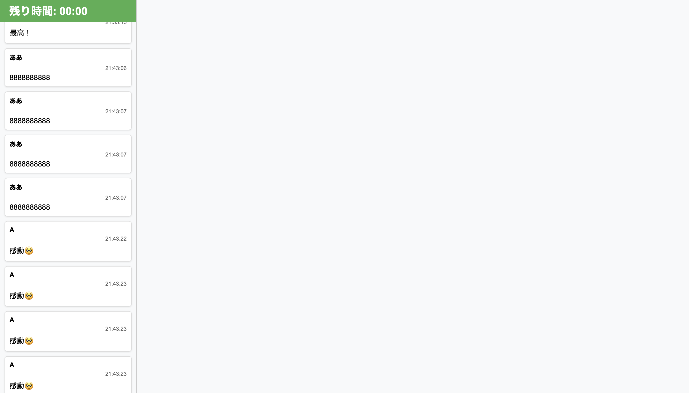

# Lt-tool


わくわくLTで横にコメント流れたら面白いかなと思って作ってみました。

# 使い方
- タイマー管理画面: http://localhost:3000/control
- 表示画面: http://localhost:3000/display
- 参加者コメントページ: http://localhost:3000/participant

# 準備に必要な環境
- 全画面表示可能なブラウザ（firefox etc,,,,）
- OBS
- node.js

# setup
```
node server.js
```

1. ローカルサーバー立ち上げる
2. OBSでdisplayページとHDMIキャプチャー画像をマージして仮想カメラ出力
3. meet or Zoomで仮想カメラを表示。
4. vscodeのトンネルに繋げる。
5. そのURLをみんなに共有する。

# コメント
chatGPTコードだよ
もっといい感じのもの作ってくれたら嬉しいな〜
